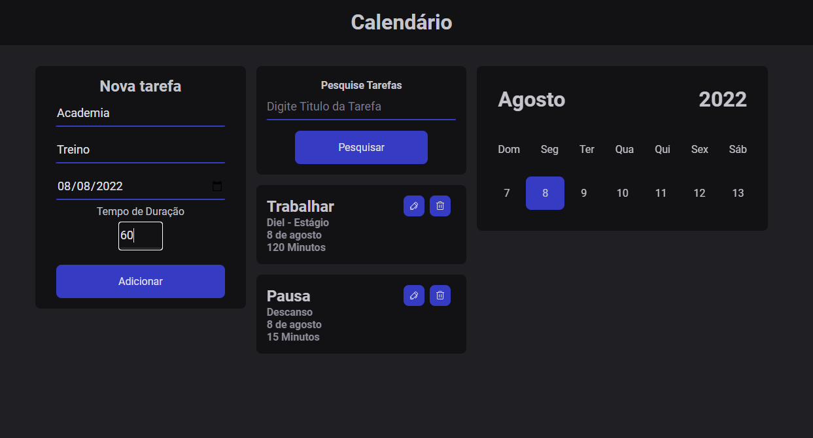
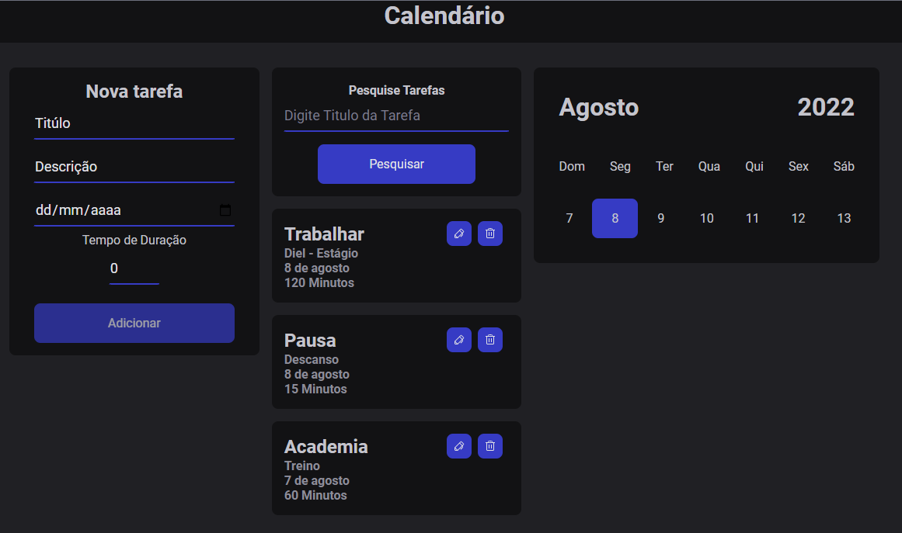
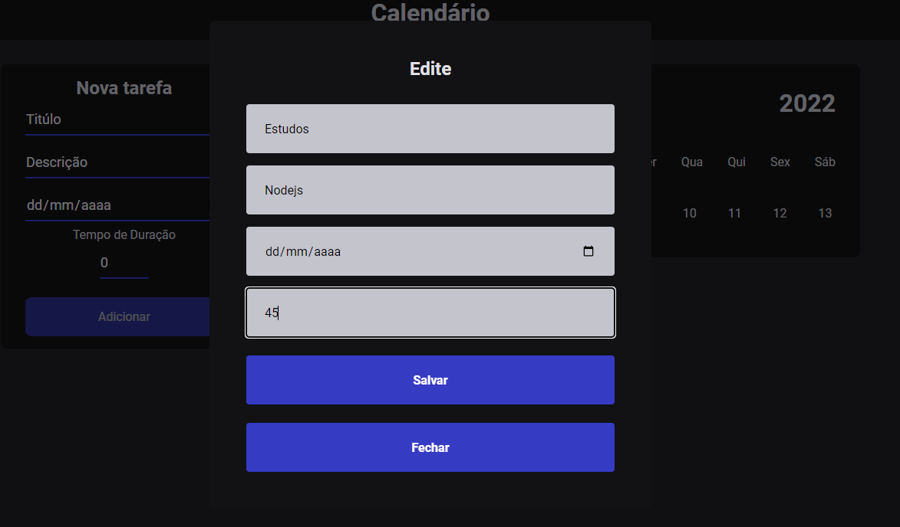
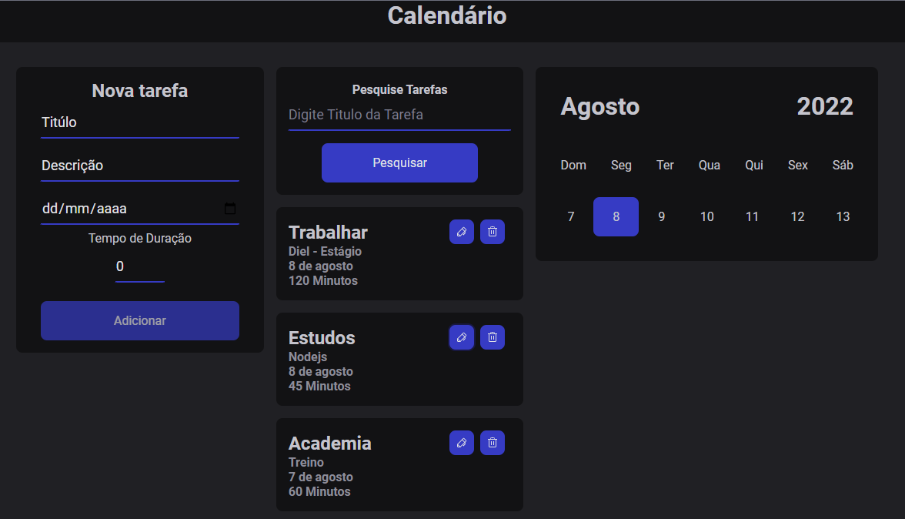
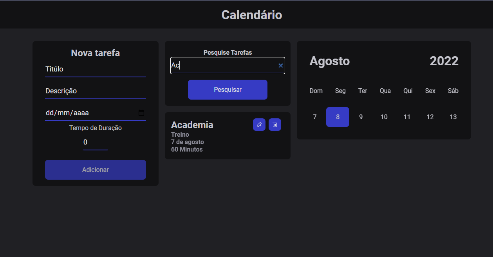
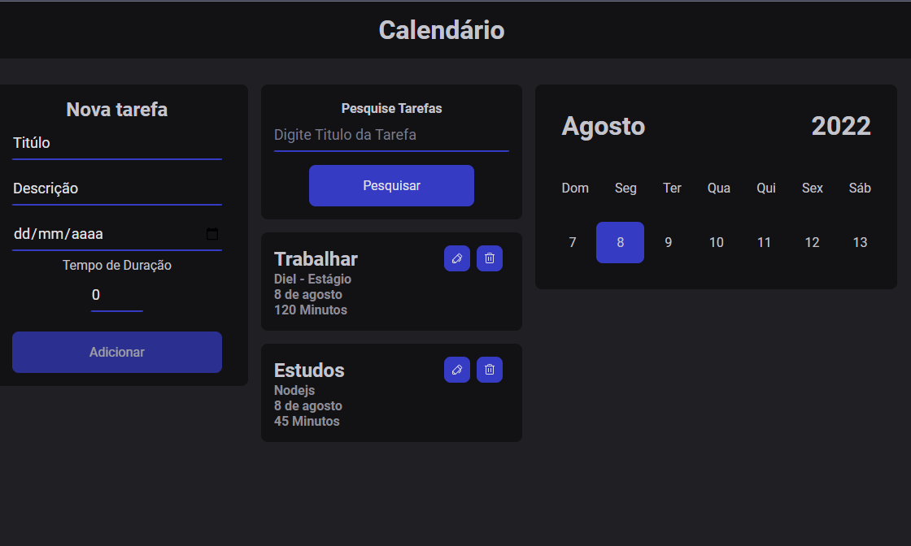

<h3 align="center">
	-- Calendário --
</h3>

<h1 align="center">
    
</h1>

### 💻 Sobre o projeto

---

- Aplicação feita para  o processo  seletivo para  estágio na Diel
  

- Um Calendário onde o usuário pode adicionar tarefas , editar , deletar ou pesquisar por elas.
  

  

  

  

  

---

### 🚀 Techs

---

- [Reactjs](https://reactjs.org/)
- [Node.js](https://nodejs.org/en/)
- [Express](https://expressjs.com/pt-br/)
- [Mysql](https://www.mysql.com/)
- [Axios](https://axios-http.com/ptbr/)
- [Styled-components](https://styled-components.com/)
- [Typescript](https://www.typescriptlang.org/)

#### back
- Setup da aplicação
- Express
- Mysql

#### front
- Componentização
- Propriedades
- Comunicação entre os componentes no reactjs
- Hooks
- Typescript

### 😯 Finalizado

Feito com ❤️ por John Rodrigues
👊 [Entre em contato!](https://www.linkedin.com/in/john-r-89643b127/)
